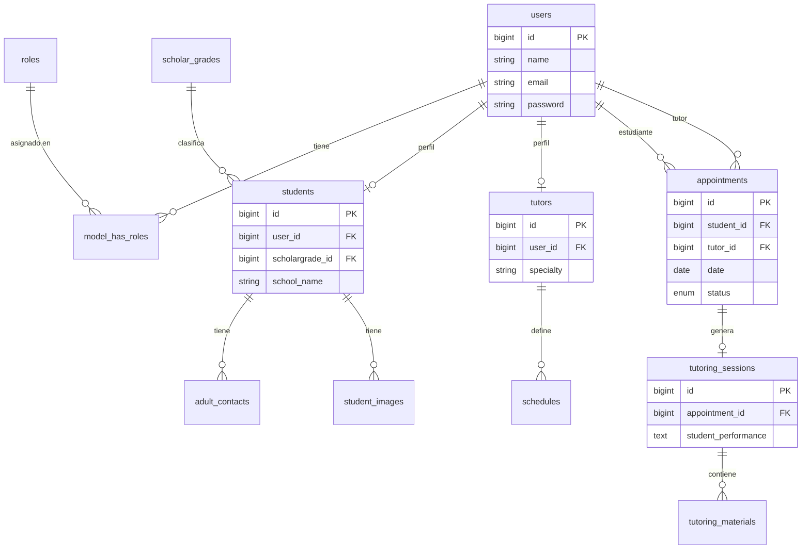

# Centro de Tutorías Red Apple

Este es un sistema de administración para la gestión de tutorías, desarrollado con **Laravel 12**, **Livewire 3** y **WireUI**.

---

## Instalación y Ejecución Rápida

1. **Clonar e instalar dependencias:**
   ```bash
   git clone https://github.com/Misael-M/Tutoring-Center---Final-Project.git
   cd Tutoring-Center---Final-Project
   composer install
   npm install
   ```

2. **Configurar entorno:**
   ```bash
   cp .env.example .env
   php artisan key:generate
   ```
   *Nota: Configura la base de datos `tutoring_center` y tu conexión de correo/WhatsApp en el `.env`.*

3. **Migrar y poblar base de datos:**
   ```bash
   php artisan migrate --seed
   php artisan storage:link
   ```

4. **Compilar assets e iniciar servidores (en terminales separadas):**
   ```bash
   npm run dev
   php artisan serve
   php artisan queue:work
   php artisan schedule:work
   ```
   Acceso: **http://127.0.0.1:8000**

---

## Credenciales del usuario de prueba

| Rol | Correo | Contraseña |
|---|---|---|
| **Administrador** | `test@example.com` | `12345678` |

---

## Diagrama Entidad-Relación (DER)


